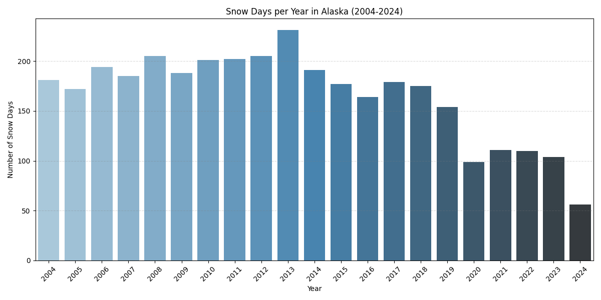

# AAE718 Project 3: The impact of global warming on Alaska

## Introduction

Global warming has become an increasingly urgent issue in recent years. People around the world are concerned about rising sea levels, increasing temperatures, and the melting of Arctic ice. These environmental changes affect all of us, whether directly or indirectly.

In this report, I explore how global warming has influenced the Arctic climate from 2004 to 2024, focusing specifically on Alaska as a case study.

## Motivation

Personally, Alaska has always had a unique charm for me. For years, I’ve watched wildlife documentaries, camping adventures, and hunting videos filmed in Alaska. Its untamed beauty feels like a priceless gift from nature. However, climate change threatens that gift.

To better understand how global warming is affecting Alaska’s climate, I gathered weather data from seven stations across the state spanning from 2004 to 2024. Using this data, I created several graphs to visualize and analyze the trends.

## Graphs

*Graph 1: Average Daily Temperature in Alaska*

This graph shows the average daily temperature in Alaska over the past two decades. Interestingly, there hasn’t been a clear upward trend in temperature. While that might seem reassuring, we can still observe that the average lowest temperatures have been slightly warmer in recent years compared to more than a decade ago.

*Graph 2: Average Daily Temperature Difference*

The second graph presents the daily temperature difference. Like the first graph, it doesn’t show strong evidence of dramatic change. However, there appears to be a subtle downward trend, suggesting that daily temperature swings may be narrowing over time.

*Graph 3: Average Daily Precipitation*

This graph illustrates average daily precipitation. Overall, precipitation patterns in Alaska have remained relatively stable over the last 20 years. Climate change does not appear to have significantly disrupted rainfall levels.

*Graph 4: Average Daily Snow Fall*

*Graph 5: Snow Days per Year*

Graph 4 and 5 are an interesting combination. Graph 4 shows average daily snowfall, which reveals several unusually high peaks over the past four years—possibly indicating more frequent or intense snowstorms.

However, Graph 5 tells us that the snow days have dropped remarkably in the last four years, this seemingly contradictory result—fewer snowy days but heavier snowfall—suggests that Alaska’s winter climate is becoming more extreme and less predictable.

## Conclusion

Alaska, known for its breathtaking landscapes and raw wilderness, is showing subtle but meaningful signs of climate change. While average temperatures and precipitation haven't shifted dramatically, there is evidence of more extreme weather patterns, such as heavier snowfall concentrated in fewer days.

These findings suggest that even in regions where average changes seem minimal, the distribution and intensity of weather events are changing—potentially reshaping ecosystems and human activity in significant ways.

## GitHub Repo Link
[Climate Project](https://github.com/WilliamJhong/Climate_Data_Project/tree/main)